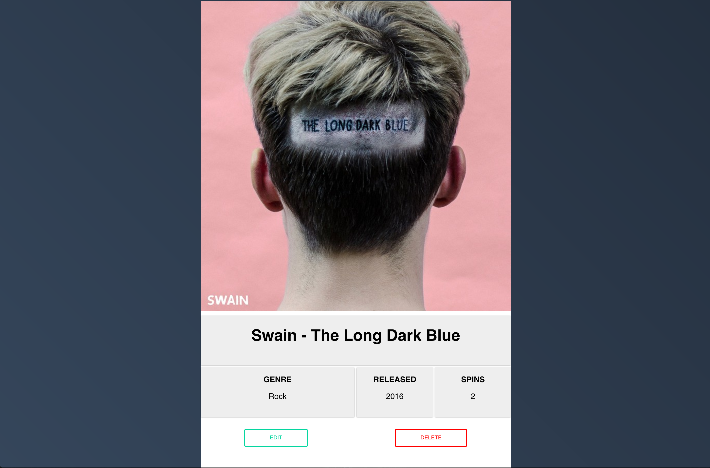

# LpDB  

### About

LpDB is a lightweight software solution to manage your record collection and help you answer the question, "Do I already own this?" quicker as you're out riffling through records. Additionally, you can track how many times you have spun a particular record, add in notes, and document various details.

### Screenshots

### API

The API I set up for this project covers the main HTTP verbs (`POST`, `GET`, `PUT`, `DELETE`, `PATCH`). All endpoints start at `/records/:userId` where `:userId` is the ObjectId of the user in MongoDB to `GET` all records and to `POST` a new record. All other methods require a call to `/records/:userId/:id` where `:id` is the ObjectId of the record being accessed. The call to the Discogs API is `POST`ed through the `/search` endpoint and the results are stored within `req.session.searchResult` for consumption on the client side.

### Technology
+ Discogs API via [disconnect](https://www.npmjs.com/package/disconnect)
+ Javascript w/ jQuery
+ Mongodb / Mongoose
+ Node / Express
+ Mocha w/ Chai
+ Passport
+ Lodash
+ SASS
+ PUG